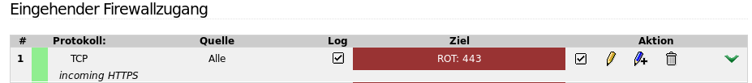
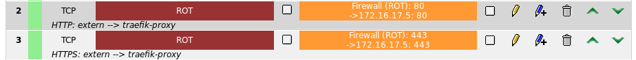

# linuxmuster-traefikproxy
docker-configuration für einen Proxy auf Basis von Traefik

# requirements
- docker and docker-compose on the host
- warning: the configurationfile docker-compose.yml is indentation sensitive! Don't use TABs.

# installation

```
# cd /srv/docker
# git clone https://github.com/jolly-jump/linuxmuster-traefikproxy.git
# cd linuxmuster-traefikproxy
# docker-compose pull
Pulling proxy (traefik:latest)...
latest: Pulling from library/traefik
...
```

# configure the domain
Before you can run the containerproxy you need to adapt to your domain:

- adapt the domain `schule.org` to your own external domain in `docker-compose.yml` and `traefik.toml`

# run the container
```
# docker-compose up
```
Check the debugging log for details, warnings and errors.

## test the installation

Use a browser to check if your proxy-redirection work or use curl on the command line, e.g. this will immitate a request to server.schule.org but requesting it from the dockerhost
```
curl -H "Host: server.schule.org" http://dockerhost
```
By default http gets redirected to https, thus enforcing to use SSL.

# configure the firewall
Default would be no redirection in ipfire or you have already configured http/https to be directed to some service. If you are using pound on IPFire, your configuration would be:



Now you want to redirect to your dockerhost using its IP, e.g.


## test the firewall
Test your redirection with the browser or curl using your external IP/DNS-Name
```
curl http://server.schule.org
```

# self-signed or letsencrypt
default is using the ssl-cert-snakeoil.key + pem from the repo

## Letsencrypt
To let the traefik-proxy create and use certificates from letsencrypt, configure and uncomment the lines in `traefik.toml`:
```
[acme]
email = "mymail@example.com"
storage = "/etc/traefik/acme/acme.json"
entryPoint = "https"
acmeLogging = true
# for production use: uncomment this, delete the acme.json and restart 
caServer = "https://acme-staging.api.letsencrypt.org/directory"
[[acme.domains]]
main = "schule.org"
sans = ["server.schule.org","cloud.schule.org","moodle.schule.org"]
```

Also comment the two lines mapping the snakeoil-certificates into the container:
```
#      - ./ssl-cert-snakeoil.key:/etc/traefik/traefik.key
#      - ./ssl-cert-snakeoil.pem:/etc/traefik/traefik.pem
```

## Production use of letsencrypt
By default the staging area of letsencrypt will be used when you restart the containers.

If the staging area worked for you, comment the ``caServer`` line to
use the production letsencrypt servers (warning: they have a rate
limit) and restart the container.
